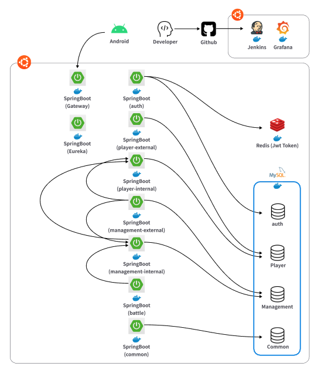

# 🐶 Mongs: 걸음 수 기반 스마트워치 펫 키우기 서비스

## Description

Mongs는 스마트워치 기반으로 사용자의 걸음 수로 펫 키우는 서비스입니다.

## Architecture

## References

- [Back-End Github](https://github.com/MongLife/monglife-mongs)
- [Android Github](https://github.com/tableMinPark/mongs_wearable)
- [Google Play Store](https://play.google.com/store/apps/details?id=com.mongs.wear)
