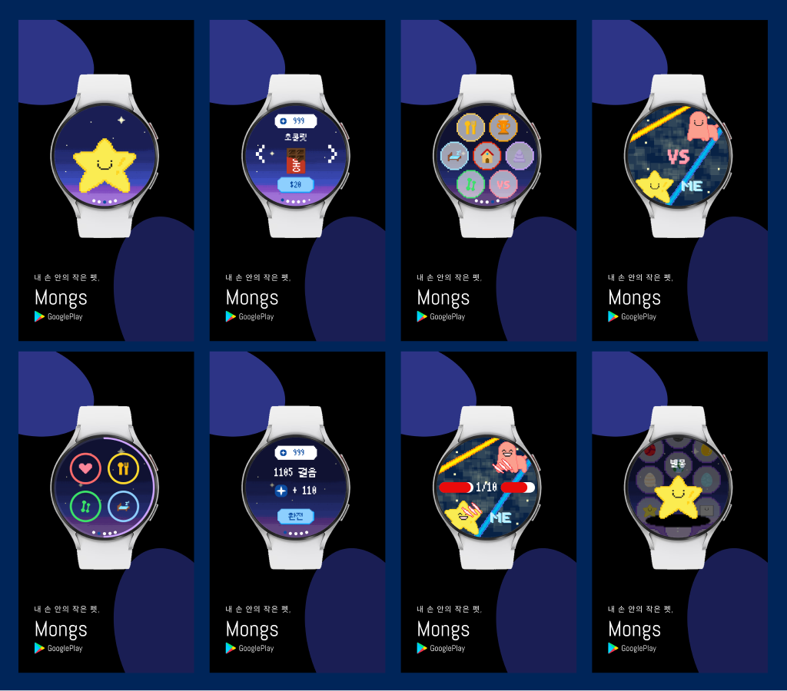

# 🚀 Mong Life Mongs Wear App 

[Mongs : 걸음 수로 키우는 다마고치 서비스](https://play.google.com/store/apps/details?id=com.mongs.wear)를 서비스하기 위한 안드로이드 앱 개발 프로젝트 입니다.

## 🏗 Project Overview

Mongs는 스마트워치 기반으로 사용자의 걸음 수로 펫 키우는 서비스입니다.

## 🐶 References

- [Back-End Github](https://github.com/MongLife/monglife-mongs)
- [Google Play Store](https://play.google.com/store/apps/details?id=com.mongs.wear)
